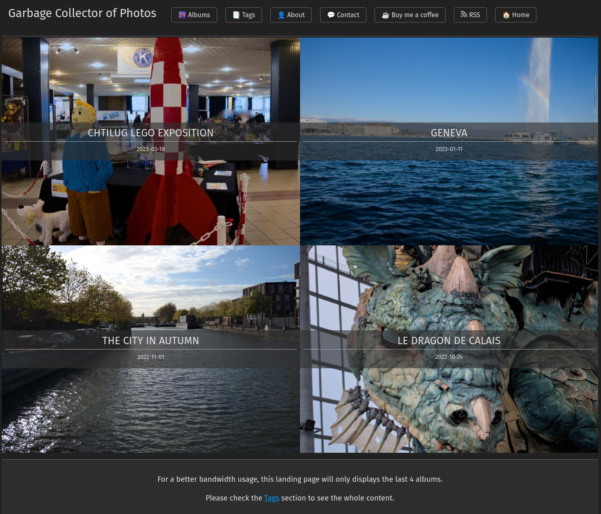

# Garbage Collector of Photos Hugo Theme

[](https://sonarcloud.io/summary/new_code?id=Wivik_garbage-collector-photo-blog-theme)



## Introduction

This theme is a custom-made for [my Photo Blog](https://photos.zedas.fr) based on [Hugo](https://gohugo.io). It is a complete new version of my previous [theme](https://github.com/Wivik/garbage-collector-photo-blog) which remains available. The front page displays the album covers, and the post page displays the gallery content with no distraction, priority to the photos. The album can be adapted to put a focus on a perticular image, add a section break, a description, etc. Each photo is viewable on a display page that will also render the EXIF metadata suchs as the pictures settings and the license.

The biggest difference with my previous theme is the pictures management : instead of having one page that links all pictures, a markdown file is created for each of them. Each page is customizable using Hugo's YAML metadata block. Please refer to the explanations below.

## How to install

Clone this repository and add the theme to your Hugo configuration.

```bash
git clone https://github.com/Wivik/garbage-collector-photo-blog-theme
```

In your config file :

```yaml
theme: garbage-collector-photo-blog-theme
```

## Configuration

This theme is very simple to configure.

Example file :

```yaml
baseURL: 'https://yoursite.com'
languageCode: 'en-us'
title: "Garbage Collector of Photos"
theme: garbage-collector-photo-blog-theme

author:
  name: Seb

menu:
  main:
    - identifier: "tags"
      name: "📑 Tags"
      url: "/tags/"
      weight: 40
    - identifier: "rss"
      name: "RSS"
      pre: <svg xmlns="http://www.w3.org/2000/svg" viewBox="0 0 24 24" width="16" height="16"><path d="M3 3C12.9411 3 21 11.0589 21 21H18C18 12.7157 11.2843 6 3 6V3ZM3 10C9.07513 10 14 14.9249 14 21H11C11 16.5817 7.41828 13 3 13V10ZM3 17C5.20914 17 7 18.7909 7 21H3V17Z" fill="rgba(220,220,220,1)"></path></svg>
      url: "/index.xml"
      weight: 50

privacy:

  vimeo:
    disabled: false
    simple: true

  twitter:
    disabled: false
    enableDNT: true
    simple: true

  instagram:
    disabled: false
    simple: true

  youtube:
    disabled: false
    privacyEnhanced: true
```

Last element : the album generation script.

At the root directory of this theme, a Python script named `new.py` was made to generate a new album. You may create a symbolink link to your Hugo site root folder to use it.

Example with symlink :

```bash
cd <your hugo site root folder>
ln -s themes/garbage-collector-photo-blog-theme/new.py new.py
```

This script will create the new album main page (`_index.md`) and a page for each photo, took in the file name order (ex: `photo1.md`, `photo2.md`...). See explanations just after in the [How to use](#how-to-use) section.

## How to use

### Quickstart

Create a directory your Hugo site `assets/` folder, for example `my-photos-album`, and put your pictures inside it.

Use the script `new.py` to create the new album :

```bash
cd <your hugo website root folder>
python new.py my-photos-album
```

The name of the folder must match the folder name inside `assets/`.

The following structure in `contents/` will be created :

```bash
my-photos-album
├── dsc_2633.md
├── dsc_2634.md
├── dsc_2635.md
├── dsc_2636.md
├── dsc_2638.md
├── dsc_2639.md
├── dsc_2641.md
├── dsc_2642.md
└── _index.md

```

Open `my-photos-album/_index.md` and edit the `photo` key to set the album thumbnail which is set to `default.png`. Replace it with a photo from the album :

```yaml
---
title: "Test"
date: 2023-07-21T18:33:15+02:00
# photo: "default.png" <<< default thumbnail
photo: "my-photos-album/photo1.jpg"
draft: false
## Optional additional meta info for resources list
#  description: A sub-title or description for the photo
tags:
  - Album
---

```

💡 The `default.png` file is not provided by this template, you can customize it by putting whichever file you want with this name in your `assets/` folder.

If you open a photo, the content will be similar :

```yaml
---
photo: "my-photos-album/photo2.jpg"
weight: "2"
draft: false
## Optional additional meta info for resources list
#  alt: Image alternative and screen-reader text
#  title: A title for the photo
#  description: A sub-title or description for the photo
---
```


Open your Hugo website, your photo album is here ! Now you can customize it.

### Customize your album

This theme uses the YAML metadata to configure your album behavior. By default, the photos will be displayed in rows of two photos. One if mobile screen. Click on a photo will open it in a larger view that will display by default the EXIF metadata and a link to download it in the original format. The photo download is the default behavior, you can disable it in [Theme configuration](#theme-specific-configurations).

The album can be customized with the following options.

#### Customize the album header (_index.md)

The album header supports the following options :

| Options | Type | Mandatory | Description |
| ------- | ---- | --------- | ----------- |
| `description` | `string` | Yes | The album description. It will be displayed before the first photo.<br />The usage of the multiline YAML syntax is supported (`description: \|`).<br />Markdown content is supported in the description. |
| `tags` | `list` | Yes | A list of tags. `Album` will be always be set and should stay, it's required to see all albums |
| `title` | `string` | Yes | The album title displayed in the front page and the album page |

Please refer to the comments in [archetypes/default.md](archetypes/default.md) for an up-to-date and exhaustive supported options.

The photo listing is customizable by editing each photo file to match how you want to display them.

#### Customize the photos display

The photo archetype supports the following options :

| Options | Type | Mandatory | Description |
| ------- | ---- | --------- | ----------- |
| `albumdisplay` | `string` | No | Adapt the alignment of the thumbnail in the album. Default is `middle`. Uses the [values](https://developer.mozilla.org/en-US/docs/Web/CSS/background-position) of the CSS attribute `background-position`.
| `description` | `string` | No | The album description. It will be displayed before the first photo.<br />The usage of the multiline YAML syntax is supported (`description: \|`).<br />Markdown content is supported in the description.<br />If `linebreak: true` is defined, the description will be shown below the photo in the album. |
| `draft` | `boolean` | No | A boolean, default `false` that controls the visibility of the photo. If set to `true`, the photo won't be displayed in the published version. |
| `linebreak` | `boolean` | No | If set to `true`, this photo will break the gallery and be emphased. If the description if filled, it will be displayed below the photo.<br />Default : `false`. |
| `photo` | `string` | Yes | The relative path to the photo in the `assets/` folder. Example : `my-photos/photo1.jpg` |
| `tags` | `list` | Yes | A list of tags. `Album` will be always be set and should stay, it's required to see all albums |
| `title` | `string` | No | The photo title. If filled, the title will be displayed at the bottom of the thumbnail. |
| `weight` | `int` | No | An integer used by Hugo to sort images. By default, the number is the number of a file in the photo lists, in alphabetic order. |

Please refer to the comments in [archetypes/photo.md](archetypes/photo.md) for an up-to-date and exhaustive supported options.

### Theme specific configurations

The theme can use the following configuration keys in your Hugo `config.yaml` file.

| Options | Type | Mandatory | Description |
| ------- | ---- | --------- | ----------- |
| `params.allowPhotoDownload` | `boolean` | No | Activate the "Download" button in the photo display page.<br />Default : `true`

### new.py reference

`new.py` is a helper script that will create your album. It currently supports the following options :


```bash
usage: new.py [-h] [-t TAGS] album

Add a new album to the gallery

positional arguments:
  album                 Name of the album

options:
  -h, --help            show this help message and exit
  -t TAGS, --tags TAGS  Tags for the album, comma-separated. Example : -t "tag1,tag2,tag3"
```

Usage example :

```bash
cd <your hugo website root folder>
python new.py my-photos-album
```

```bash
cd <your hugo website root folder>
python new.py my-photos-album -t "Space,Penguins,Rocks"
```

The tags will be appended to the default "Album" tag in the `_index.md` file.

```yaml
---
title: "Test"
date: 2023-07-21T18:33:15+02:00
photo: "default.png"
draft: false
## Optional additional meta info for resources list
#  description: A sub-title or description for the photo
tags:
  - Album
  - Space
  - Penguins
  - Rocks
---

```

## License and Attributions

This theme is licensed under the [MIT License](LICENSE).

Some CSS parts come from the [SimpleCSS](https://simplecss.org) framework for general design like buttons and navigation header.

The Creative Commons formater partial uses [Remix Icons](https://github.com/Remix-Design/remixicon) which are available under Apache License 2.0.

The partial invoked by the EXIF reader shortcode is a contribution from Hugo's forum. This specific part is licensed under a Creative Common Attribution NonCommercial ShareAlike 3.0 Unported License as [indicated by their ToS](https://discourse.gohugo.io/tos#3).

